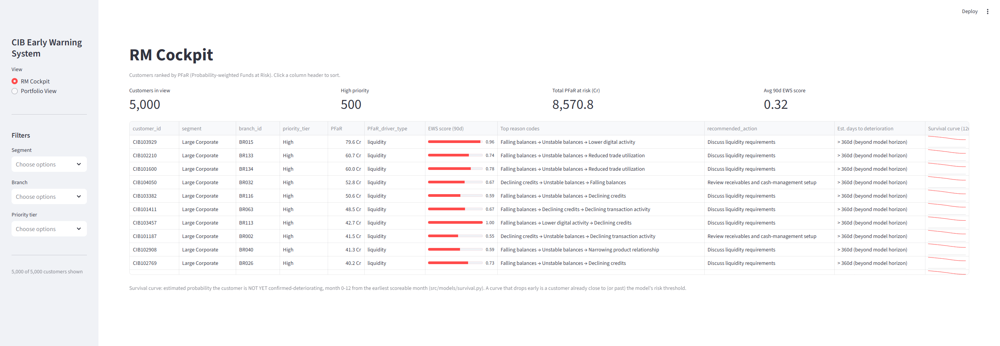
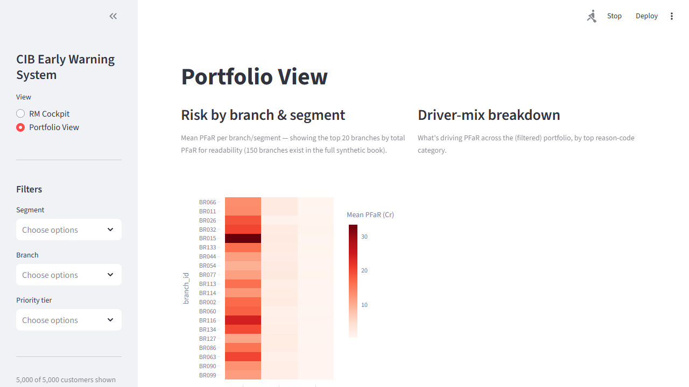

# CIB Early Warning System (EWS)

## Business Problem

HDFC Bank's Current Account / CIB ("Customers in Base") portfolio faces a
quieter risk than account closure: large corporate customers keep their
HDFC current account technically open while gradually shifting balances,
transaction flow, payroll processing, and trade activity to competing
banks. Today, relationship managers act reactively — only after the
balance erosion is already visible in monthly reports, by which point most
of the wallet share is already gone. This project builds an Early Warning
System that scores each CIB customer for **30–90 day advance risk of
silent deterioration**, explains *why* via reason codes derived from their
transaction behavior, and recommends the specific RM action to take —
turning a lagging, reactive process into a forward-looking one. Since real
HDFC data isn't available, the entire pipeline runs on a realistic
**synthetic** CA/CIB dataset (with known ground-truth deterioration
cohorts for validation), built so a real core-banking data source could be
substituted later without reworking the feature, model, or dashboard code.

## Key Results at a Glance

| | |
|---|---|
| **Core model (XGBoost, 90d horizon)** | ROC-AUC 0.958 · PR-AUC 0.903 · 6.3x lift in the top decile |
| **Label validation vs. hidden ground truth** | 98.9% precision / 98.3% recall on planted deterioration cohorts; 0.1-1.7% false-positive rate on stable/seasonal cohorts |
| **Survival model (time-to-deterioration)** | Concordance index 0.659 (Random Survival Forest, chosen after Cox's proportional-hazards check failed on 46% of covariates) |
| **Graph feature experiment** | Honest negative result — no AUC improvement; traced to 0.88-0.91 correlation with an existing feature, not a dead end hidden from the numbers |
| **End-to-end deliverable** | Synthetic data → labels → features → model → SHAP reason codes → PFaR risk sizing → RM actions → survival estimate → Streamlit dashboard |

Full methodology, every number, and the reasoning behind each modeling
choice: [`docs/methodology.md`](docs/methodology.md).

## Screenshots

**RM Cockpit** — customers ranked by PFaR, filterable, with inline survival-curve sparklines:



**Portfolio View** — branch/segment risk heatmap, driver-mix breakdown, PFaR trend:



## Project Structure

```
cib-ews/
├── data/
│   ├── raw/                     # synthetic raw data (generated, not hand-edited)
│   └── processed/               # engineered features, labels, scores, PFaR, survival curves
├── src/
│   ├── config.py                 # shared paths, random seed — the ONE seam a real data source plugs into
│   ├── data_generation/          # synthetic CA/CIB data generator (Phase 1)
│   ├── labeling/                 # deterioration index + forward-looking labels (Phase 2a)
│   ├── features/                 # 5-group feature pipeline (Phase 2b)
│   ├── models/                   # baseline, core GBM, survival, PFaR, action engine (Phases 3-7)
│   ├── explainability/           # SHAP reason codes (Phase 5)
│   └── graph/                    # networkx wallet-leakage graph feature (Phase 8)
├── notebooks/                    # EDA (cohort trajectory sanity check)
├── app/
│   └── dashboard.py              # Streamlit RM Cockpit + Portfolio View (Phase 9)
├── results/
│   ├── models/                   # trained model artifacts (.joblib)
│   ├── metrics/                  # evaluation tables, comparisons, PH checks (.csv/.json/.txt)
│   └── figures/                  # ROC/PR/lift/calibration/coefficient/survival/importance plots
├── docs/
│   ├── methodology.md            # this project's master document
│   ├── deterioration_definition.md
│   ├── feature_dictionary.md
│   ├── explainability.md
│   └── figures/                  # Phase 1 EDA plots
├── tests/                        # (not yet built)
├── requirements.txt
└── README.md
```

## How to Run — End to End

**Environment:** Python 3.12. All commands below assume the repo root as
the working directory.

```bash
python -m venv .venv
source .venv/bin/activate        # Windows: .venv\Scripts\activate
pip install -r requirements.txt
```

Then, in order (each step reads the previous step's output — see the
detailed subsections below for what each one does and why):

```bash
# 1. Generate the synthetic dataset
python -m src.data_generation.generate_synthetic_data

# 2. Build deterioration labels
python -m src.labeling.run_labeling

# 3. Build the 5-group feature table
python -m src.features.build_features

# 4. Train the explainable baseline (logistic regression)
python -m src.models.baseline_logistic

# 5. Tune + train the core model (XGBoost/LightGBM), pick the winner
python -m src.models.core_gbm

# 6. SHAP reason codes + customer scoring
python -m src.explainability.score_customers

# 7. RM action mapping + PFaR risk segmentation
python -m src.models.pfar

# 8. Survival analysis (time-to-deterioration)
python -m src.models.survival

# 9. Wallet-leakage graph feature (stretch; re-evaluates the core model)
python -m src.graph.wallet_leakage
python -m src.graph.reevaluate_core_model

# 10. Launch the dashboard
streamlit run app/dashboard.py
```

Total runtime end-to-end is roughly 15-20 minutes on a laptop CPU, most of
it in the synthetic data generation (~2 min), SHAP scoring over 90,000
rows (~3 min), and the core-model hyperparameter search (~2-3 min).

See [`docs/methodology.md`](docs/methodology.md) for the full narrative —
business problem, every phase's methodology and results, validation
metrics, known limitations of synthetic data, and the path to production.
The subsections below are the step-by-step reference.

### 1. Set up the environment

```bash
python -m venv .venv
source .venv/bin/activate        # Windows: .venv\Scripts\activate
pip install -r requirements.txt
```

### 2. Generate the synthetic dataset

```bash
python -m src.data_generation.generate_synthetic_data
```

*(Command will be finalized once the generator is built — Phase 1.)*

### 3. Build the deterioration labels

```bash
python -m src.labeling.run_labeling
```

Reads `data/raw/{customers,monthly_panel,ground_truth_cohorts}.parquet`,
computes the composite Deterioration Index, applies the seasonal
false-positive filter, builds `deteriorates_in_{30,60,90}d`, validates
against the known ground-truth cohorts, and saves
`data/processed/deterioration_labels.parquet`. See
[`docs/deterioration_definition.md`](docs/deterioration_definition.md) for
what the index means and how the threshold was chosen.

### 4. Build features

```bash
python -m src.features.build_features
```

Builds all 5 feature groups (Balance & Liquidity, Transaction & Digital
Activity, Product & Wallet-Share, Network & Counterparty, Relationship &
Engagement), merges in the Phase 2 labels, applies a time-based train/test
split, and saves `data/processed/model_dataset.parquet`. See
[`docs/feature_dictionary.md`](docs/feature_dictionary.md) for every
feature's definition and business rationale.

### 5. Train the baseline model

```bash
python -m src.models.baseline_logistic
```

Trains the explainable benchmark — logistic regression (median imputation +
standardization + one-hot encoding, `class_weight="balanced"`) — for each
of the 3 label horizons, on a **time-based** train/test split (train on
months 0-11, test on months 12-17, never random — this is a forecasting
problem). Reports ROC-AUC, PR-AUC, precision/recall, and lift-by-decile;
plots calibration and the top risk-increasing/decreasing coefficients for
interpretability. Saves everything to `results/{models,metrics,figures}/`.

### 6. Train the core model (XGBoost / LightGBM, lightly tuned)

```bash
python -m src.models.core_gbm
```

Runs a small randomized hyperparameter search (8 draws per model per
horizon, scored on a time-based validation slice — never K-fold CV, which
would reintroduce random-split leakage) for both XGBoost and LightGBM,
evaluates the tuned models on the held-out test set with the same metrics
as the baseline (ROC-AUC, PR-AUC, precision/recall, calibration), and picks
**one algorithm as "the core model"** by average test PR-AUC across all 3
horizons. Requires `results/metrics/baseline_logreg_summary.csv` to exist
first (run step 5 above).

**Result: XGBoost chosen as the core model** (mean PR-AUC 0.928 vs
LightGBM's 0.895 across horizons) — the winning models are saved as
`results/models/core_model_{30,60,90}d.joblib`:

| Horizon | Model | ROC-AUC | PR-AUC | Precision@0.5 | Recall@0.5 | Top-decile lift |
|---|---|---|---|---|---|---|
| 90d | logistic_regression | 0.935 | 0.841 | 0.429 | 0.910 | 5.85 |
| 90d | lightgbm (tuned) | 0.951 | 0.854 | 0.000 | 0.000 | 6.16 |
| 90d | xgboost (tuned) | 0.958 | 0.903 | 0.544 | 0.925 | 6.29 |

(See `results/metrics/core_gbm_comparison.csv` for all 3 horizons.)

Worth noting: LightGBM's PR-AUC/lift are close to XGBoost's, but at the
default 0.5 threshold its precision/recall collapse to 0 — its predicted
probabilities skew low even with `scale_pos_weight`. This is exactly why
the core-model choice is made on PR-AUC (threshold-free) rather than a
fixed cutoff — see `src/models/core_gbm.py` for the reasoning.

### 7. Explainability — SHAP reason codes

```bash
python -m src.explainability.score_customers
```

Computes SHAP values from the core XGBoost model (90-day horizon) for
every customer-month, maps the top contributing features to plain-language
driver labels (`src/explainability/config.py:FEATURE_TO_DRIVER_LABEL` —
e.g. "Falling balances", "Rising competitor-transfer share", "Reduced
payroll activity"), and saves a customer-level scored table —
`customer_id, month, ews_score_30d/60d/90d, top_3_reason_codes` — to
`data/processed/customer_scores.parquet`. Requires the core models from
step 6 above. See [`docs/explainability.md`](docs/explainability.md) for
the full reasoning behind the driver-label mapping and how reason codes
are ranked.

### 8. RM action mapping + PFaR risk segmentation

```bash
python -m src.models.pfar
```

`src/models/action_engine.py` maps a customer's top reason code to a
concrete recommended action via a swappable rules-based lookup (the exact
table is business-specified — see the module for the extended coverage of
labels beyond that table, and the documented interface a future
contextual-bandit recommender could implement in its place once real
RM-outcome feedback exists).

`src/models/pfar.py` computes **PFaR** (Probability-weighted Funds at
Risk) = `ews_score_90d x estimated_balance_at_risk`, where the expected
balance-decline % is calibrated empirically from customers our OWN
labeling framework has historically confirmed as deteriorating (never from
Phase 1's hidden ground truth — that would be leakage a real deployment
could never replicate). Decomposes PFaR into a driver type
(liquidity/relationship/competitor) from the top reason code, assigns
High/Medium/Low priority tiers by portfolio-relative PFaR rank, and saves
`customer_id, month, segment, PFaR, PFaR_driver_type, priority_tier,
recommended_action` to `data/processed/pfar_risk_segmentation.parquet`
(one row per customer — their latest scored month). Requires steps 6-7
above.

**Note:** PFaR intentionally weights by rupee exposure, so a "top 20 by
PFaR" table is dominated by Large Corporate customers even at moderate
risk scores — a very-high-probability SME can rank far lower in absolute
PFaR. A probability-only or within-segment view is a natural complement
for surfacing those cases, not yet built.

### 9. Survival analysis (time-to-erosion)

```bash
python -m src.models.survival
```

Frames "will this customer deteriorate" as "how long until this customer
deteriorates" — the event is the labeling framework's own
`confirmed_deterioration` flag (never the hidden ground truth), snapshotted
at each customer's earliest fully-defined month (month_idx=5). A
CoxPHFitter is fit first, as the standard baseline, and explicitly checked
via `check_assumptions` — it flagged **11 of 24 covariates (46%)** as
violating the proportional-hazards assumption, including nearly every
balance-trend feature. That's a pervasive violation, not a couple of
borderline cases, so the model actually used is a **Random Survival
Forest** (scikit-survival) instead, which makes no such assumption. The
train/test split is customer-level (not row-level time-based — see the
module docstring for why that doesn't translate to one-row-per-customer
survival data), but the same "never train on what wouldn't be known yet"
discipline is reproduced by administratively censoring the training fit at
month 11 and evaluating concordance against full follow-up through month
17 on held-out customers, before refitting a deployment model on
everyone's full follow-up for the actual scored table.

**Result: concordance index = 0.659** (Cox's, for comparison, was 0.591 —
also worse, consistent with the assumption violation). Modest compared to
the classification models' 0.90+ AUC — expected, since this model gets
only ONE early snapshot per customer rather than fresh trailing features
every month. Saves `customer_id, segment, risk_score,
predicted_median_days_to_deterioration` to
`data/processed/survival_scores.parquet` (joinable with
`customer_scores.parquet` by `customer_id`), plus 3 example survival
curves in `results/figures/survival_example_curves.png`.

### 10. Graph features (wallet-leakage, stretch)

```bash
python -m src.graph.wallet_leakage
python -m src.graph.reevaluate_core_model
```

**Scoping note:** the synthetic data only records each transaction's
*counterparty bank*, not a counterparty entity identifier, so the graph
built here is a customer↔bank bipartite graph (~5,000 customer nodes, 11
bank nodes) rather than the richer customer↔customer graph the phase name
evokes — that would need real counterparty account IDs. `wallet_leakage.py`
builds one bipartite graph per month and computes, per customer: a
value-weighted competitor-bank share and its 3m/6m trend (both read
directly off graph edge weights), plus two genuinely graph-native
measures — bank-diversity degree, and a value-weighted exposure to bank
eigenvector centrality computed across the *whole portfolio's* graph each
month (captures whether a customer is disproportionately connected to a
bank that's gaining share portfolio-wide, not just relative to their own
history).

`reevaluate_core_model.py` refits the tuned XGBoost core model (Phase 5's
already-chosen hyperparameters, held fixed, so only the feature set
changes) with and without the 4 graph features, on identical splits.

**Result: the graph features did NOT meaningfully improve the model.**
ROC-AUC/PR-AUC are flat to very slightly worse at every horizon (e.g. 90d
PR-AUC: 0.9027 → 0.9019), and they rank 14th-25th of 27 features by mean
|SHAP| — nowhere near top drivers. Traced the cause: the value-weighted
graph features correlate **0.88-0.91** with Phase 2's existing
`competitor_txn_share`/`_trend` (pandas-derived, from the same underlying
transactions). The graph computation is methodologically distinct
(bipartite eigenvector centrality vs. direct aggregation), but on data
this size it mostly re-derives information XGBoost already had. The one
partial validation: mean |SHAP| for the competitor-share graph feature
*is* higher for `sudden_deterioration` (0.133) and `gradual_deterioration`
(0.096) than `stable` (0.040) — the right directional signal, just not an
incremental one. Full numbers in
`results/metrics/graph_feature_before_after.csv` and
`graph_feature_shap_check.txt`. Kept in the codebase as an honestly-negative
result and the natural extension point once real counterparty-entity data
exists (the customer↔customer graph would likely show a real effect via
shared-counterparty contagion, which this bank-level version cannot see).

### 11. Run the dashboard

```bash
streamlit run app/dashboard.py
```

A UX prototype (not hardened for production), styled with a banking-style
header and theme (`.streamlit/config.toml`), with three views toggled from
the sidebar:

- **RM Cockpit** — one row per customer, ranked by PFaR, filterable by
  segment/branch/priority tier, with EWS score, plain-language top reason
  codes, recommended action, estimated days to deterioration, and an
  inline 12-month survival-curve sparkline per row
  (`st.column_config.LineChartColumn` — no separate detail panel needed).
- **Portfolio View** — risk heatmap by branch/segment (top 20 branches by
  total PFaR, for readability — 150 exist in the full book), a driver-mix
  pie chart, and a portfolio-wide PFaR trend (month-over-month, since the
  underlying data is monthly, not weekly).
- **About This Project** — a plain-language walkthrough of the whole
  pipeline, key results, tech stack, and author credit for anyone landing
  on the dashboard without the README.

**Branding note:** the header uses a generic bank glyph and a scrolling
disclaimer banner, not HDFC Bank's actual logo or "confidential/internal
use" language — this repository is public, under the author's own name,
and independent of HDFC Bank, so the banner says exactly that instead.

Requires steps 6-9 above to have been run at least once (reads their
parquet outputs directly — no live scoring). Verified end-to-end with
browser automation across all three views, including catching and fixing
two real bugs: `streamlit run app/dashboard.py` sets `sys.path[0]` to
`app/`, not the project root, so `from src.config import ...` failed until
the project root was explicitly added to `sys.path`; and a raw `None` in
the "days to deterioration" column (a real outcome — see
`src/models/survival.py` — not missing data) read as broken until replaced
with an explicit label.

## Presentation Deck

```bash
python docs/presentation/build_presentation.py
```

Generates `docs/CIB_EWS_Presentation.pptx` — a 15-slide walkthrough deck
(business problem → approach → results for every phase → limitations →
path to production) styled to match the dashboard, for talking through the
project in an interview without switching to the repo. Regenerate it any
time after updating results; the script pulls the same figures used
throughout this README from `docs/figures/` and `results/figures/`.

## Project Phases

All phases below are complete except the last one.

1. ✅ Synthetic data generation (customer master + monthly panel +
   counterparty transactions + ground-truth cohorts)
2. ✅ Deterioration labeling (composite index + forward-looking labels) and
   5-group feature engineering
3. ✅ Baseline model (logistic regression) + evaluation framework
4. ✅ Core model (XGBoost / LightGBM), lightly tuned, compared to baseline
5. ✅ Explainability (SHAP) → reason codes per customer
6. ✅ RM action mapping + PFaR risk segmentation
7. ✅ Survival analysis (Cox → Random Survival Forest) → time-to-
   deterioration estimate
8. ✅ Graph feature (networkx wallet-leakage, stretch) → re-evaluated
   against the core model (honest negative result — see §5.4 of
   `docs/methodology.md`)
9. ✅ Streamlit dashboard (RM Cockpit + Portfolio View)
10. ⬜ Automated tests — not yet built. `docs/methodology.md` (this phase)
    covers documentation; a `tests/` suite (unit tests for the labeling
    thresholds, feature leakage-safety, and the action/PFaR logic) is the
    one remaining gap.

See [`docs/methodology.md`](docs/methodology.md) for the full narrative,
results, limitations, and path to production.

## License

Copyright (c) 2026 Agastya Sharma. All Rights Reserved. This repository is
public for portfolio/demonstration purposes only — see [`LICENSE`](LICENSE)
for terms. No permission is granted to reuse, modify, or redistribute this
code without prior written permission.

## Author

**Agastya Sharma**
[work.agastya20@gmail.com](mailto:work.agastya20@gmail.com) ·
[GitHub @agastyasharma20](https://github.com/agastyasharma20)
